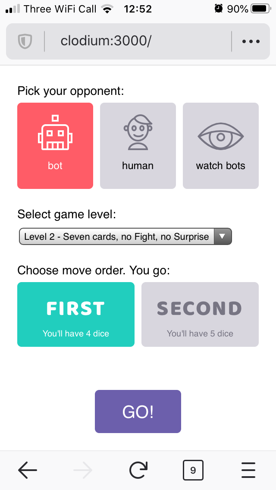
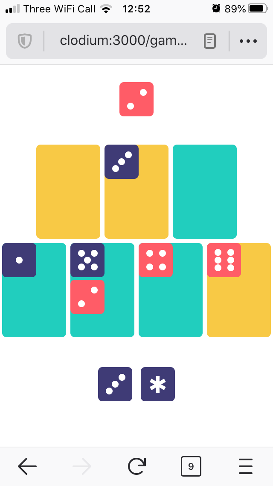

# Rokumon

An AI, web interface and a console application for playing [Rokumon game](https://boardgamegeek.com/thread/2380440/wip-rokumon-2020-9-card-design-contest-contest-rea) by Charles Ward.

The AI is written in Rust and compiled to WebAssembly to be used in the web interface (which is written in JavaScript using React). This allows to run a reasonably strong computer opponent right in your browser (and it even works on smartphones and other mobile devices).

Rokumon is a nice little game with simple rules and interesting gameplay. It can be played with just seven ordinary playing cards and a handful of dice of two colors. So, if you have this very easy to find "equipment", you can easily try it with friends.

Also, if you don't have a worthy opponent, you can always play against my bot! :)

# Game setup screen



# Game play screen



Rules of the game can be found in this repository in [misc/docs/rules.pdf](misc/docs/rules.pdf)

# Structure of the project

The projects consists of four sub-projects:

- `rokumon_core` - game logic, rules and AI
- `rokumon_console_ui` - console application to play with the bot and analyze games
- `rokumon_wasm` - interface exposed to JavaScript web-app via WebAssembly
- `www` - web application in React, calling the bot via WebAssembly

# How to contribute

This project is still pretty much a work in progress and there are many things to do, so I would be quite happy to get pull requests!

If you want to play with Rust/WebAssembly/React/JavaScript/WebWorkers/CSS and want to help with the project, you can take a look at the [issues list](https://github.com/sphynx/rokumon/issues). I've marked some of the easy ones with "good first issue" tag, they may be a reasonable starting point.

Instructions about how to build and run the project are below. Please create a Github issue, if you have any questions or difficulties with building or running it.

# How to build, install and play with the command line application

It's written in Rust programming language, so you have to run usual invocations for setting up Rust:

1. Install `rustup`, a standard installer for Rust (it supports variety of platforms including Linux, Mac and Windows):
https://rustup.rs/

2. Run `cargo build --release`. Cargo is package manager and build system for Rust which will download and build all depedencies and `rokumon` itself.

3. Then after some time you'll have a built `rokumon` executable in `target/release/rokumon`, you can run it directly:

```
➜  target/release/rokumon --help
rokumon 0.1.0

USAGE:
    rokumon [FLAGS] [OPTIONS]

FLAGS:
        --ai-to-completion           Whether AI should run its analysis to full completion before making the move
    -f, --enable-fight-move          Allows 'Fight' move in the game rules (disabled by default)
    -s, --enable-surprise-move       Allows 'Surprise' move in the game rules (disabled by default)
    -h, --help                       Prints help information
        --no-shuffle                 If we don't want to shuffle the deck before starting the game
        --second-ai-to-completion    Whether second AI should run its analysis to full completion before making the move
    -V, --version                    Prints version information

OPTIONS:
        --ai-depth <ai-depth>                        How deep AI should analyse the position (in plies, i.e. half-moves)
        --ai-duration <ai-duration>                  How much time AI should use for its moves (in seconds)
        --cards <cards>
            Cards to be used in the game (g - gold, j - jade) [default: gggjjjj]

    -l, --layout <layout>                            Layout: Bricks7 or Square6 (for Act I) [default: bricks7]
    -m, --mode <mode>                                play | perft | par_perft [default: play]
    -o, --opponents <opponents>
            HumanHuman | HumanAI | AIHuman | AIAI | RandomRandom [default: HumanAI]

        --perft-depth <perft-depth>                  Depth for performance tests [default: 5]
        --samples <samples>                          Number of matches to play (for AI vs AI games) [default: 10]
        --second-ai-depth <second-ai-depth>
            How deep second AI should analyse the position (in plies, i.e. half-moves)

        --second-ai-duration <second-ai-duration>    How much time second AI should use for its moves (in seconds)
```

4. Then you can play a game against an AI like this:

```
target/release/rokumon --opponents HumanAI
```

Note that you are much advised to build release version of the game (as opposed to `debug`), since AI in debug mode will be very weak.

There are multiple command line options described in `--help` which control AI, opponents and game rules.

You can, for example, ask two AIs to play against each other, control amount of time AI uses for its move, enable or disable 'fight' and 'surprise' moves in Rokumon rules and do other things.

# How to build and serve the web application locally

In order to serve the local version of the website you'll need to install Node.js and npm, for that you can follow the guide [here](https://docs.npmjs.com/downloading-and-installing-node-js-and-npm#using-a-node-version-manager-to-install-node-js-and-npm):

Also, I assume that you have Rust installed (if not, just follow the guide on https://rustup.rs/, it's pretty easy on Windows/Linux/MacOS and other platforms).

I automated most of the tasks in something called `Justfile`, it's an analog of Makefiles, but using `just`, a simple build system written in Rust. It's similar to `make`, but without its idiosyncrasies.

So you can do this:

1. Run `cargo install just` (or `brew install just` if you are on MacOS and prefer to use `brew` for your tools)
2. Run `just serve`

After some compilation and prepation, you should see the webserver started and serving Rokumon web app on `localhost:3000`.
